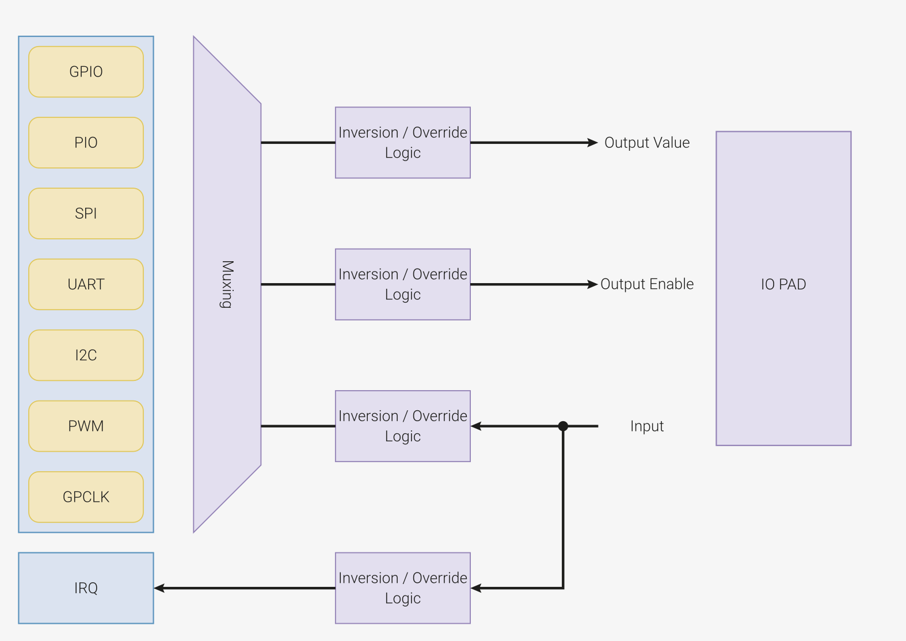
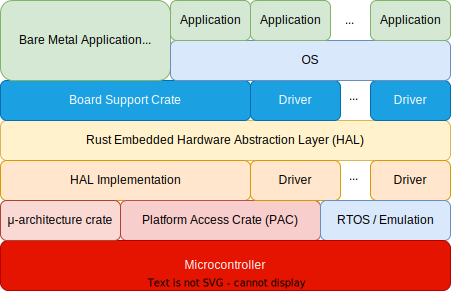
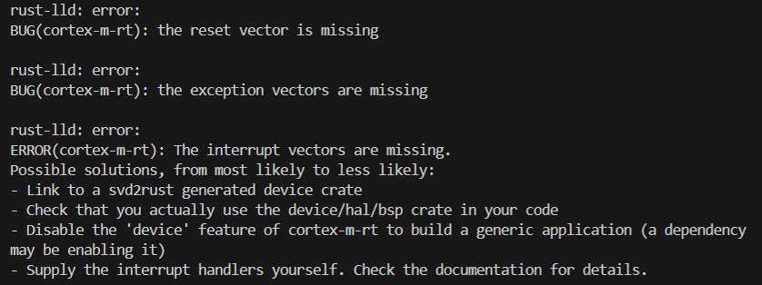

# General Purpose Input Output

The purpose of this lab is to understand how to start developing in [Rust](https://www.rust-lang.org/) for the
RP2040 MCU. The lab presents three examples:

- **bare metal** development - writing directly to registers, actually writing a driver
- **platform access crate** (PAC) - using an automatically generated crate from the MCUs SVD file, actually writing a driver, but with some kind of automation
- **embassy-rs** - using the Rust standard [`embedded-hal`](https://docs.rs/embedded-hal/latest/embedded_hal/) implemented by the [Embassy-rs](https://embassy.dev/) framework.

:::info
The example of this lab is to blink an LED at a certain time interval.
:::

## Resources

1. **Raspberry Pi Ltd**, *[RP2040 Datasheet](https://datasheets.raspberrypi.com/rp2040/rp2040-datasheet.pdf)*
2. **Raspberry Pi Ltd**, *[Raspberry Pi Pico Datasheet](https://datasheets.raspberrypi.com/pico/pico-datasheet.pdf)*
3. **Raspberry Pi Ltd**, *[Raspberry Pi Pico W Datasheet](https://datasheets.raspberrypi.com/picow/pico-w-datasheet.pdf)*

## What is GPIO?

General-Purpose Input/Output, or GPIO, is an essential part of embedded systems that serves as a vital conduit between microcontrollers and microprocessors and the outside world. A microcontroller or microprocessor's group of pins that can each be set to operate as an input or an output is referred to as GPIO. The purpose of these pins is to interface external components, including actuators, displays, sensors, and other devices, so that the embedded system may communicate with its surroundings. Standardised communication protocols like SPI, I2C, PCM, PWM, and serial communication may be directly supported by some GPIO pins. There are two varieties of GPIO pins: digital and analog.

## Configuring GPIO Pins

GPIO pins can be used as outputs (LEDs, motors, buzzers) or as inputs (buttons, sensors).

The R02040 has three peripherals that control the GPIO pins:

1. *Pads* - control the actual physical pin or pad that the processor has outside. This control the electrical parameters, like maximum current or pull up and pull down resistors
2. *IO Bank0* - connects and multiplexes the peripheral's pins to the output pads. Several peripherals use the same output pad to communicate with the exterior. For example, in the image below, `GPIO0` can be used either for:
   - `SIO` - the `GPIO` function
   - `SPI_RX` - the receive pin for the `SPI` peripheral
   - `I2C0_SDA` - the data pin for the `I2C0` peripheral
   - `UART0_TX` - the transmit pin for the `UART0` (serial port 0) peripheral
3. *SIO* - that controls the interior MCU's pins. This is the peripheral that developers use to read and write the value of the pins.


Every pin of the MCU can perform multiple functions. Several peripherals need to use input and output pins.
It is the role of the *IO Bank0* to multiplex and connect the peripherals to the pins.

<div align="center">

</div>

## Hardware access

There are 3 different ways in which the hardware the Raspberry Pi Pico can be used:

1. Embassy-rs framework, with the Embedded HAL implementation
2. Platform Access Crate (PAC)
3. Bare metal

## Embedded HAL Implementation

The bare metal and PAC require a lot of time and effort to develop applications.

The Rust [Embedded devices Working Group](https://www.rust-lang.org/governance/wgs/embedded) has designed
a  set of standard traits (interfaces) for interacting with an MCU. This is called the **Embedded Hardware Abstraction Layer**, or shortly Embedded HAL. The main purpose is to define a common hardware interface that
frameworks, libraries and operating systems can build upon. Regardless of what MCUs the device is using, the upper level software should be as portable as possible.

There are several crates and frameworks that implement the Embedded HAL traits for the RP2040 MCU.

- [rp2040_hal](https://docs.rs/rp2040-hal/latest/rp2040_hal/) crate, implements just the embedded HAL traits, it is *the bare minimum* for developing RP2040 applications
- [embassy-rp](https://docs.embassy.dev/embassy-rp/git/rp2040/index.html) crate implements the Embedded HAL for RP2040 that is used with the [embassy-rs](https://embassy.dev/) framework

### Embassy-rs framework

[Embassy-rs](https://embassy.dev/) is a full fledged embedded framework for Rust embedded development.
Besides the implementation of the embedded HAL for different MCUs (RP2040 included), embassy-rs provides
several functions like timers, BLE and network communication.

<div align="center">

</div>

The crates used by Embassy-rs and their mapping are shown in the table bellow.

| Crate | Position |
|-------|----------|
| [`embassy-executor`](https://docs.embassy.dev/embassy-executor/git/cortex-m/index.html) | Framework |
| [`smoltcp`](https://docs.rs/smoltcp/latest/smoltcp/), [`defmt`](https://docs.rs/defmt/latest/defmt/) | Libraries |
| [`embassy-net`](https://docs.embassy.dev/embassy-net/git/default/index.html), [`embassy-time`](https://docs.embassy.dev/embassy-time/git/default/index.html), [`embassy-usb`](https://docs.embassy.dev/embassy-usb/git/default/index.html), [`embassy-usb-logger`](https://docs.embassy.dev/embassy-usb-logger/git/default/index.html) | Framework Driver |
| [`embassy-usb-driver`](https://docs.embassy.dev/embassy-usb-driver/git/default/index.html), [`embassy-time-driver`](https://docs.embassy.dev/embassy-time-driver/git/default/index.html) | Embassy HAL (API) |
| [`cyw43`](https://docs.embassy.dev/cyw43/git/default/index.html), [`cyw43-pio`](https://docs.embassy.dev/cyw43-pio/git/default/index.html) | Driver (WiFi) |
| [`embedded-hal`](https://docs.rs/embedded-hal/latest/embedded_hal/), [`embedded-hal-async`](https://docs.rs/embedded-hal-async/latest/embedded_hal_async/)| **Rust Embedded HAL (Standard)** |
| [`embassy_rp`](https://docs.embassy.dev/embassy-rp/git/rp2040/index.html) | HAL Implementation |
| [`cortex-m`](https://docs.rs/cortex-m/latest/cortex_m/), [`cortex-m-rt`](https://docs.rs/cortex-m-rt/latest/cortex_m_rt/) | μ-architecture crates |
| [`rp_pac`](https://docs.embassy.dev/rp-pac/git/default/index.html) | Platform Access Crate |

:::info

The name *Embassy-rs* is derived form **Emb**edded **Asy**nchronous Rust.

:::

### Entry

Embassy-rs is a framework built on top of `cortex-m-rt` and provides its own method of defining
the entrypoint and bootloader.

```rust
use embassy_executor::Spawner;

#[embassy_executor::main]
async fn main(_spawner: Spawner) {
    let peripherals = embassy_rp::init(Default::default());
}
```

The `embassy_rp::init` function takes care of the peripheral initialization so that developers can jump
right in and use them.

:::note

Embassy-rs is designed to work in an asynchronous way and this is why the `main` function is defined as `async`. For the time being, just take it as a must and ignore it.

:::

### Configure GPIO Output

Embassy-rs provides one single function that returns the GPIO `Output` pin and hides the configuration
details from developers.

The `pin` variable implements the embadded HAL [`OutputPin`](https://docs.rs/embedded-hal/latest/embedded_hal/digital/trait.OutputPin.html) trait.

```rust
use gpio::{Level, Output};

// initialize PIN_n (replace n with a number) and set its
// default value to LOW (0)
let mut pin = Output::new(peripherals.PIN_n, Level::Low);

// set the pin value to HIGH (1)
pin.set_high();

// set the pin value to LOW (0)
pin.set_low();
```

:::tip

While the device initialization is specific to every hardware device (the example uses the 
`embassy_rp` crate that is for RP2040), the pin initialization and usage is portable. It
uses the same code, regardless of the MCU used.

:::

### Configure GPIO Input

Using a pin as input is very similar to using it as output.

```rust
use gpio::{Input, Pull};

let pin = Input::new(peripherals.PIN_n, Pull::Up);

if pin.is_high() {
    // Do something if the pin value is HIGH (1)
} else {
    // Do something if the pin value if LOW (0)
}
```

:::warning

For a correct use of the buttons, use pull-up, pull-down resistors depending on the mode of operation of the button.

:::

### Waiting

Embassy-rs provides support for suspending the execution of the software for an amount of time. It uses
the [`Timer`](https://docs.rs/embassy-time/0.3.0/embassy_time/struct.Timer.html) structure from the
[`embassy_time`](https://docs.rs/embassy-time/latest/embassy_time/) crate.

```rust
// suspend the execution for a period of time
use embassy_time::Timer;

Timer::after_secs(1).await;
```

:::tip

If the MCU provides timers, the Embassy framework will use them to suspend the software. This is very efficient.

:::

### no-std

As the code written runs on an MCU without any framework or operating system,
the Rust compiler cannot rely on the `std` library. The two macros directives
ask the compiler not to link the `std` library and not to expect `main`
function.

```rust
#![no_main]
#![no_std]
```

:::info

In most embedded projects, the MCU does not run any framework or operating system, it just runs the developers bare metal code. This is why `main` function is not allowed to return, it loops forever. There is no system to which the function
could return control.

In Embassy, the `main` function does not have to loop indefinitely, it is allowed to return, as it runs within the embassy-rs framework.

:::

## Build and flash

### Build

To build a program for the Raspberry Pi Pico, run the following command in the crate's root folder (where the `Cargo.toml` file and `src` folder are):

```shell
cargo build
```


This will create the binary file inside `target/thumbv6m-none-eabi/debug/`.

:::note

If the crate is part of a workspace (as it is the lab template), the `target` folder is located in the workspace's root instead of the crate's root. 

:::

### Flash

To load your program to the Raspberry Pi Pico, connect the board through USB to your computer while holding down the `BOOTSEL` button. It should appear as an external drive on your system. Afterwards, you can run the following command (also from the crate's root folder):

```shell
elf2uf2-rs -d target/thumbv6m-none-eabi/debug/<crate_name>
```

This will upload your program to the Pico.

:::note

If you are running this command from within a crate inside of a workspace, don't forget to navigate to the target folder by using `../../`
Example:
```shell
elf2uf2-rs -d ../../target/thumbv6m-none-eabi/debug/<crate_name>
```

:::

:::note

If the above command doesn't work, try these steps instead:

- run this command: 
```shell
elf2uf2-rs target/thumbv6m-none-eabi/debug/<crate_name>
```

- drag and drop the `.uf2` file located in the `target/thumbv6m-none-eabi/debug/` folder to the RP external drive

:::

### Serial console

To see messages from the Pico over the serial port, add the `-s` argument to the flash command:

```shell
elf2uf2-rs -s -d /target/thumbv6m-none-eabi/debug/<crate_name>
```

This will allow us to see messages sent over serial from the board.

### Troubleshooting

#### Link error - reset vector is missing

In case you get an error similar to this:

<div align="center">

</div>

That means that you most probably forgot to add the *entry point* to your program. Make sure you add `#[entry]` before your main function so that the MCU knows to call it at startup.

#### Flash succeeds, the application does not start

In case your code doesn't seem to get uploaded correctly or the board goes into `BOOTSEL` mode as soon as you plug it into your computer, it might be time to debug. To install required dependencies for debugging, run these commands:

```shell
rustup component add llvm-tools

cargo install cargo-binutils
```

Now, you can run this command:

```shell
rust-objdump --section-headers target/thumbv6m-none-eabi/debug/<crate_name>
```

This will let us see the layout of the binary file, or the memory of the program that we are about to flash to the board.

<div align="center">

</div>

We need to make sure that it contains the `.boot_loader` section, or else our program will never run.

Further reading: [Embassy Tutorial](../tutorials/embassy)

## Exercises

1. Use [KiCad](https://www.kicad.org/) to design a simple circuit that connects an LED to GPIO 0 (GP0). (**1p**)

:::warning 

The maximum current that GPIO pins output depends on the MCU. To be sure that the LED will work normally and there is no risk of destruction, a resistor has to be added to limit the current level *below* the maximum GPIO output current.

:::

2. Write a program using Embassy that set on HIGH the LED connected to GPIO pin 0 (GP0). (**2p**)

:::danger 

Please make sure the lab professor verifies your circuit before it is powered up.

:::

3. Write a program using Embassy that blinks the LED connected to GPIO pin 0 (GP0) every 300ms. (**2p**)

:::note

For the purpose of this lab, please use `await` as is, think that for using the `Timer`, you have to add `.await` after the `after` function.

:::

4. Write a program using `embassy-rs` that will write the message "The button was pressed" to the console every time button A is pressed. Take a look at the Pico Explorer Base's pinout to determine the pin to which button A is connected. (**2p**)

<div align="center">

</div>

:::info

The Raspberry Pi Pico does not have an integrated debugger, so writing messages to the console is done
with a simulated serial port over the USB. This implies the usage of a USB driver.

```rust
use embassy_rp::usb::{Driver, InterruptHandler};
use embassy_rp::{bind_interrupts, peripherals::USB};
use log::info;

// Use for the serial over USB driver
bind_interrupts!(struct Irqs {
    USBCTRL_IRQ => InterruptHandler<USB>;
});


// The task used by the serial port driver 
// over USB
#[embassy_executor::task]
async fn logger_task(driver: Driver<'static, USB>) {
    embassy_usb_logger::run!(1024, log::LevelFilter::Info, driver);
}

#[embassy_executor::main]
async fn main(spawner: Spawner) {
    let peripherals = embassy_rp::init(Default::default());

    // Start the serial port over USB driver
    let driver = Driver::new(peripherals.USB, Irqs);
    spawner.spawn(logger_task(driver)).unwrap();

    // ...

    info!("message");
}
```

:::warning

Make sure you sleep while looping to read the button's value, otherwise 
the USB driver's task will not be able to run and the messages will 
not be printed.

:::

:::

5. Write a Rust program using `embassy-rs` that toggles the LED every time button A is pressed. (**1p**)

6. Write a Rust program that sets on HIGH the LED connected to GPIO pin 0 (GP0). (**1p**)
   1. use the `rp2040-pac` crate
   2. use bare metal

7. Write a Rust program that blinks the LED connected to GPIO pin 0 (GP0) every 300ms. (**1p**)
   1. use the `rp2040-pac` crate - write a `PinDriver` that implements the [`OutputPin`](https://docs.rs/embedded-hal/latest/embedded_hal/digital/trait.OutputPin.html) trait
   2. use bare metal - write a `PinDriver` that implements the [`OutputPin`](https://docs.rs/embedded-hal/latest/embedded_hal/digital/trait.OutputPin.html) trait

## Advanced topics

### Debouncing techniques for stable input reading.

Noise is produced whenever a pushbutton or other switch is moved. Because the switch contact is made of metal and has some elasticity, there is some noise (contact). The switch literally bounces a few times once it makes contact with a metal surface when it is shifted into a new position. This contact is known as bounce. 

<div align="center">

</div>

The image above shows the signal produced by a button when pressed.

The most correct way to correct the bouncing problem is the hardware one, but there are also software methods to correct the problem. For more details and examples, consult the documentation from Embassy-rs and the examples provided by them.